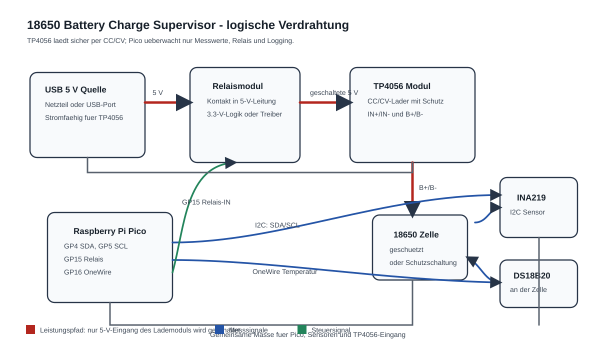
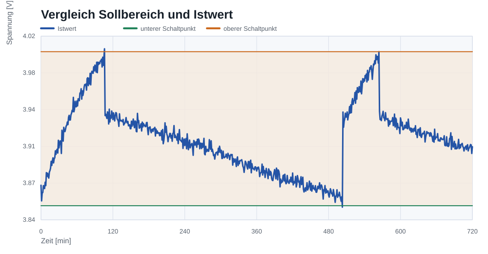
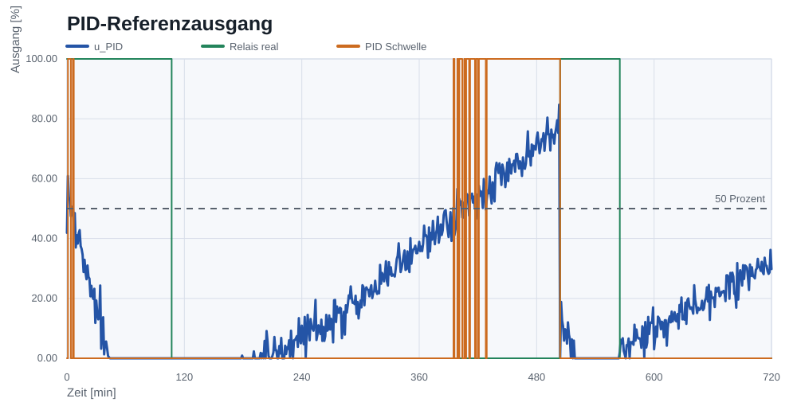

# 18650 Ladelogik mit Raspberry Pi Pico und MicroPython

Ein regelungstechnisches Embedded-Projekt zur uebergeordneten Ueberwachung
des Ladevorgangs einer einzelnen geschuetzten 18650-Li-Ion-Zelle. Das sichere
CC/CV-Laden uebernimmt ein fertiges TP4056-Lademodul mit Schutzschaltung. Der
Raspberry Pi Pico misst, schaltet die 5-V-Versorgung des Lademoduls per Relais,
ueberwacht Grenzwerte, loggt Messdaten und wertet die Regelung mathematisch aus.



## Projektziel

18650 Ladelogik zeigt, wie ein einfacher, robuster Zweipunktregler mit
Hysterese in ein praxisnahes Embedded-System eingebettet wird. Zusaetzlich
wird ein PID-Referenzregler auf die Messdaten angewandt, um die klassische
Regelungstechnik sauber zu erklaeren und mit der realen Relaislogik zu
vergleichen.

Die Rollen bleiben bewusst getrennt:

- TP4056: eigentliche Li-Ion-Ladekurve mit Konstantstrom/Konstantspannung
- Raspberry Pi Pico: Messung, Freigabe, Abschaltung, Logging und Auswertung
- Relais: trennt nur die 5-V-Versorgung zum TP4056, nie die Zelle direkt
- PID-Auswertung: mathematischer Vergleichsregler in Simulation/Analyse,
  kein echter Ladealgorithmus fuer die Zelle

## Sicherheitshinweise

Dieses Projekt ist ein Lern- und Demonstrationsaufbau. Es ist kein zertifiziertes
Ladegeraet, kein Batteriemanagementsystem und keine Produktempfehlung fuer den
unbeaufsichtigten Betrieb.

Wichtige Regeln:

- Kein selbstgebautes CC/CV-Laden ueber GPIO, PWM, DAC oder Software-Regelung.
- Nur geschuetzte 18650-Zellen oder Zellen mit geeigneter Schutzschaltung verwenden.
- Das Relais schaltet ausschliesslich den 5-V-Eingang des TP4056-Moduls.
- Der Temperaturfuehler muss thermisch an der Zelle befestigt werden.
- Grenzwerte: Laden ein unter 3,85 V, Laden aus ueber 4,00 V, Notabschaltung
  bei 45 Grad C, Ueberspannungsabschaltung bei 4,18 V.
- Zellen unter 2,50 V werden nicht automatisch geladen, sondern muessen
  kontrolliert und bewertet werden.
- Echte Tests nur unter Aufsicht, mit brandsicherer Unterlage, geeigneter
  Schutzschaltung und im Zweifel mit zusaetzlicher Strombegrenzung durchfuehren.

## Bauteilliste

| Bauteil | Funktion |
|---|---|
| Raspberry Pi Pico | Uebergeordnete Steuerung, Logging und I2C |
| TP4056-Modul mit Schutzschaltung | Sicheres CC/CV-Laden der Einzelzelle |
| Geschuetzte 18650-Zelle | Energiespeicher im Testaufbau |
| INA219 Strom-/Spannungssensor | Messung von Zellspannung und Ladestrom per I2C |
| DS18B20 oder NTC | Temperaturmessung an der Zelle |
| Relaismodul | Schaltet die 5-V-Versorgung des TP4056 |
| 4,7-kOhm-Widerstand | Pull-up fuer DS18B20 OneWire |
| Kabel/Breadboard | Aufbau und Verbindung |
| Optional SSD1306 OLED | Lokale Statusanzeige |

Die vollstaendige BOM liegt unter [`hardware/bom.csv`](hardware/bom.csv).

## Regelungskonzept

### Realer Regler: Zweipunktregler mit Hysterese

Der Pico hat nur eine binaere Stellgroesse: Relais ein oder Relais aus. Deshalb
ist die reale Ladefreigabe als Zweipunktregler aufgebaut:

- Wenn die gemessene Zellspannung kleiner oder gleich 3,85 V ist, darf das
  Relais einschalten.
- Wenn die Zellspannung groesser oder gleich 4,00 V ist, schaltet das Relais
  wieder ab.
- Zwischen 3,85 V und 4,00 V bleibt der vorherige Relaiszustand erhalten.
- Bei Ueberspannung, Unterspannung ausserhalb des sicheren Bereichs oder zu
  hoher Temperatur wird ein Fehler gelatcht und das Relais bleibt aus.

Mathematisch:

```text
u_relais[k] = 1, wenn y[k] <= 3,85 V
u_relais[k] = 0, wenn y[k] >= 4,00 V
u_relais[k] = u_relais[k-1], sonst
```

`y[k]` ist die gemessene Zellspannung. Die Hysterese verhindert schnelles
Takten des Relais im Grenzbereich.

### Angewandter PID-Referenzregler

Ein PID-Regler wird im Projekt angewandt, aber bewusst nur als
Referenzmodell fuer Datenanalyse und Regelungsverstaendnis. Der Ausgang
`u_pid` wird nicht an den Akku oder den TP4056 ausgegeben.

Als Sollwert dient die Mitte des Hysteresebands:

```text
w = (3,85 V + 4,00 V) / 2 = 3,925 V
e[k] = w - y[k]
I[k] = clamp(I[k-1] + e[k] * Delta t, I_min, I_max)
D[k] = (e[k] - e[k-1]) / Delta t
u_pid[k] = sat(Kp * e[k] + Ki * I[k] + Kd * D[k], 0 %, 100 %)
```

Verwendete Parameter der Simulation:

| Parameter | Wert | Bedeutung |
|---|---:|---|
| `Kp` | 850 %/V | reagiert direkt auf Spannungsabweichung |
| `Ki` | 2,4 %/(V min) | korrigiert bleibende Abweichung langsam |
| `Kd` | 55 % min/V | daempft schnelle Aenderungen |
| `I_min` / `I_max` | -8 / +8 V min | Anti-Windup-Begrenzung |

Die PID-Ausgabe wird als theoretische Ladefreigabe zwischen 0 % und 100 %
interpretiert. Fuer ein echtes Relais muesste daraus wieder eine harte
Schaltentscheidung entstehen. Genau daran sieht man den Kern der Auslegung:
Ein PID-Regler ist lehrreich und in den Daten angewandt, die reale Hardware
bleibt aus Sicherheitsgruenden bei Hysterese plus Grenzwertueberwachung.

## Aufbau

Die Verdrahtung ist in [`hardware/wiring.md`](hardware/wiring.md) beschrieben.
Der wichtige Punkt: Die Relaiskontakte liegen im 5-V-Eingang des TP4056. Die
Zelle bleibt am Lademodul beziehungsweise an ihrer Schutzschaltung angeschlossen.

Empfohlene Pico-Pins:

- GP4: I2C SDA fuer INA219 und optional OLED
- GP5: I2C SCL fuer INA219 und optional OLED
- GP15: Relais-Eingang
- GP16: DS18B20 OneWire

## MicroPython-Code

Die Firmware liegt im Ordner [`firmware/`](firmware/):

- [`firmware/main.py`](firmware/main.py): Hauptprogramm mit Messschleife,
  Hysterese-Regler, Fehlerlatch, CSV-Logging und optionaler OLED-Ausgabe
- [`firmware/config.py`](firmware/config.py): Pins, Grenzwerte und Sensoroptionen
- [`firmware/lib/ina219.py`](firmware/lib/ina219.py): kleiner INA219-Treiber

Logfelder auf dem Pico:

`timestamp`, `elapsed_s`, `cell_voltage_v`, `charge_current_mA`,
`temperature_c`, `relay_state`, `soc_percent`, `mode`, `fault_reason`

## Messdaten und Plots

Da keine realen Messwerte beiliegen, erzeugt das Projekt realistisch wirkende
Simulationsdaten. Das Modell bildet eine TP4056-aehnliche Stromkurve, thermische
Traegheit, den Hysterese-Schaltverlauf und den PID-Referenzausgang ab.

```bash
python3 scripts/generate_test_data.py
python3 scripts/plot_results.py
```

Erzeugte Artefakte:

- [`data/simulated_charge_log.csv`](data/simulated_charge_log.csv)
- [`plots/voltage_over_time.svg`](plots/voltage_over_time.svg)
- [`plots/current_over_time.svg`](plots/current_over_time.svg)
- [`plots/temperature_over_time.svg`](plots/temperature_over_time.svg)
- [`plots/relay_state_over_time.svg`](plots/relay_state_over_time.svg)
- [`plots/setpoint_vs_actual.svg`](plots/setpoint_vs_actual.svg)
- [`plots/pid_reference_output.svg`](plots/pid_reference_output.svg)
- [`plots/pid_terms.svg`](plots/pid_terms.svg)





## Ergebnisse

Die Simulation zeigt das erwartete Verhalten:

- Unterhalb von 3,85 V wird der TP4056 freigegeben.
- Der Ladestrom liegt zunaechst im typischen TP4056-Bereich und faellt nahe der
  oberen Spannung ab.
- Bei 4,00 V trennt das Relais die 5-V-Versorgung des Lademoduls.
- Die Temperatur steigt waehrend der Ladephase moderat an und bleibt unterhalb
  der dokumentierten Notabschaltung.
- Der Relaiszustand zeigt klar die Hysterese und verhindert schnelles Takten.
- Der PID-Referenzausgang zeigt, wie ein kontinuierlicher Regler die
  Spannungsabweichung bewerten wuerde, ohne die sichere Hardwarelogik zu
  ersetzen.

## GitHub Pages

Die Projektseite liegt im Ordner [`docs/`](docs/) und ist fuer GitHub Pages
vorbereitet. Sie enthaelt Motivation, Regelungstechnik, PID-Mathematik,
Hardware, Schaltplan, Code-Erklaerung, Messdaten, Sicherheitskapitel und Fazit.

## Repository-Struktur

```text
.
├── README.md
├── firmware/
│   ├── main.py
│   ├── config.py
│   └── lib/ina219.py
├── hardware/
│   ├── bom.csv
│   ├── wiring.md
│   └── wiring_diagram.svg
├── scripts/
│   ├── generate_test_data.py
│   └── plot_results.py
├── data/
│   └── simulated_charge_log.csv
├── plots/
│   └── *.svg
└── docs/
    ├── index.html
    ├── styles.css
    └── assets/
```
